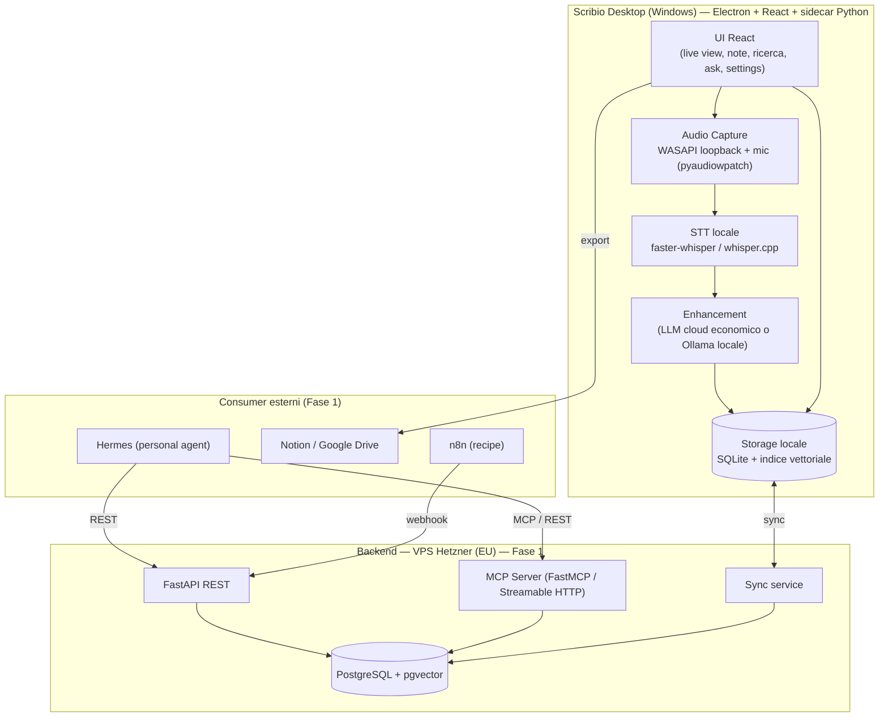

# PRD — Scribio: AI Notepad self-hosted per riunioni

> **Nome prodotto**: Scribio
> **Autore**: Andrea Iaccino
> **Versione**: 0.5 (draft)
> **Data**: 17 giugno 2026
> **Stato**: in definizione — restano alcune decisioni tecniche aperte (§10)
> **Changelog 0.4 → 0.5**: enhancement semplificato a **solo OpenAI** (BYOK con API key OpenAI) per l'MVP; rimossi gli adapter multi-provider, rimandati a fase futura.
> **Changelog 0.3 → 0.4**: enhancement **solo cloud** via API key dell'utente (OpenAI, Anthropic, …); rimossa l'opzione LLM locale per l'enhancement; supporto multi-provider tramite **adapter** (OpenAI + Anthropic + generico OpenAI-compatible), non endpoint unico.
> **Changelog 0.2 → 0.3**: enhancement LLM in modalità **BYOK** (bring-your-own-key); chiusa la decisione §10.2; aggiunti campi BYOK e nota su storage sicuro delle chiavi.
> **Changelog 0.1 → 0.2**: nome (Mnemo → Scribio); UI promossa a core di prodotto (Fase 0); trascrizione locale-first; MCP/API/Notion declassati a "di più"; architettura riorganizzata attorno a un'app desktop.

---

## 1. Sintesi esecutiva

Scribio è un'app desktop self-hosted, ispirata a Granola, a uso personale e di team ristretto (Andrea + collaboratori Thrive X / Minimo Lab). Cattura l'audio delle riunioni a livello di sistema operativo (senza bot in call), lo trascrive **in locale** sulla macchina dell'utente, e fonde gli appunti grezzi presi a mano con il transcript per produrre note strutturate "enhanced".

Il fulcro del prodotto è una **UI desktop bella, moderna e completa**: l'utente fa tutto da dentro l'app — registra, prende appunti, legge le note enhanced, cerca, interroga la propria memoria di riunioni. Le integrazioni esterne (agente Hermes via MCP, Notion, ecc.) sono un **valore aggiunto**, non il punto d'ingresso.

I dati restano sull'infrastruttura di Andrea: in locale sulla macchina e, quando attivo il sync, sul VPS Hetzner (EU). L'audio raw non viene mai persistito.

**Scope iniziale**: solo Windows. macOS rimandato a fase successiva.

**Non-obiettivo dichiarato**: NON è un prodotto da rivendere. Si ottimizza per "funziona benissimo sulle nostre macchine ed è bellissimo da usare", non per scalare su utenti sconosciuti.

---

## 2. Problema e contesto

### 2.1 Il problema
Nelle riunioni (call commerciali, 1:1, allineamenti interni, interviste) serve restare presenti senza perdere informazioni. Granola risolve esattamente questo, ma sul piano gratuito lo storico si blocca dopo ~30 giorni, i transcript delle call client vivono su infra terza, e non è integrato nello stack di Andrea.

### 2.2 Perché costruirlo
1. **UI propria e controllo totale** sull'esperienza e sui dati.
2. **Costo zero di trascrizione** (STT locale) e archivio permanente senza abbonamento per il team.
3. **Privacy dei dati client** su infra propria (EU → favorevole GDPR).
4. **Integrazione con Hermes** via MCP/API come capacità aggiuntiva (non più il driver principale, ma resta in roadmap).

### 2.3 Cosa NON è gratis
La **trascrizione** è locale e gratuita. L'**enhancement** delle note richiede un LLM **cloud**, per l'MVP **solo OpenAI**, gestito in modalità **BYOK**: ogni utente inserisce nei settings la propria API key OpenAI e paga il proprio consumo (pochi centesimi a riunione). Niente LLM locale per l'enhancement. Andrea non sostiene i costi LLM del team. Vedi §5.4 e §7.4.

---

## 3. Utenti e personas

| Persona | Descrizione | Esigenza primaria |
|---|---|---|
| **Andrea (power user)** | Builder, usa Hermes/n8n, call commerciali e tecniche | UI completa + archivio permanente + (poi) memoria interrogabile da Hermes |
| **Collaboratori (Danny, Matteo, Luca…)** | ~3-4 persone, profili tecnici/semitecnici | UI semplice e bella, note automatiche affidabili, attrito minimo |

Assunzione: utenti pochi e su macchine note → si può imporre il setup (cuffie, modello STT adatto all'hardware). Questo semplifica l'ingegneria.

---

## 4. Obiettivi e metriche

### 4.1 Obiettivi
- **G1**: catturare e trascrivere qualsiasi call su Windows senza bot, qualunque piattaforma (Meet, Zoom, Teams, VoIP).
- **G2**: trascrizione **in locale**, senza costi ricorrenti e senza far uscire l'audio dalla macchina.
- **G3**: una **UI desktop moderna e completa** da cui fare tutto: registrare, annotare, leggere note enhanced, cercare, chiedere.
- **G4**: produrre note enhanced strutturate (appunti + transcript) entro pochi minuti dalla fine call.
- **G5**: esporre la memoria via **MCP** e **REST API** (Hermes primo consumer) — capacità aggiuntiva.
- **G6**: dati su infra propria; audio raw mai persistito.

### 4.2 Metriche di successo (uso interno)
- Tempo fine call → note enhanced: **< 3 min**.
- % call catturate da Andrea in settimana tipo: **> 80%**.
- Qualità trascrizione italiano su audio pulito: "buona/ottima".
- "Bellezza e usabilità" della UI: giudizio soggettivo di Andrea — deve sembrare un prodotto vero, non un tool interno.

---

## 5. Requisiti funzionali

### 5.1 UI / UX (core di prodotto — Fase 0)
- **RF-UI-1** App desktop con UI moderna, pulita, veloce, keyboard-friendly. Direzione estetica proposta (in linea col gusto di Andrea): **dark, minimale, tipografica**, accento lime-fluo (#CAFE0E), zero clutter. Da confermare.
- **RF-UI-2 — Home / Lista riunioni**: timeline delle riunioni con ricerca e filtri (data, tipo, partecipanti). Stato visibile (in corso / in trascrizione / pronta).
- **RF-UI-3 — Vista live (durante la call)**: layout a due colonne — a sinistra il **notepad** per gli appunti grezzi, a destra il **transcript live** (parziale, near-real-time). Pulsante start/stop ben visibile. Indicatore di cattura attiva.
- **RF-UI-4 — Vista riunione (post call)**: note **enhanced** in editor Markdown ricco ed editabile; toggle **"My notes" / "Enhanced"**; transcript collassabile; lista **action item**; pulsanti **Recipe**; pannello **"Ask Scribio"** (chat sulla riunione).
- **RF-UI-5 — Ask globale**: chat che interroga tutte le riunioni (RAG), con citazione della call sorgente.
- **RF-UI-6 — Template manager**: crea/modifica template per tipo di riunione dentro la UI.
- **RF-UI-7 — Settings**: scelta modello STT e dimensione, device audio, **configurazione LLM** (API key OpenAI + scelta modello), retention, account/sync, token MCP/API.
- **RF-UI-8 — Onboarding**: primo avvio guida permessi audio, download modello whisper, scelta device.

### 5.2 Cattura audio (Windows)
- **RF-1** Cattura simultanea di **system audio loopback** (= altri partecipanti) e **microfono** (= utente) via WASAPI loopback.
- **RF-2** Flussi tenuti **separati** (canale "me" / "others"): evita echo/doppio conteggio e dà attribuzione speaker gratis.
- **RF-3** Start/stop manuale dalla UI. Nessuna cattura passiva automatica.
- **RF-4** Disclosure consenso facilitata/ricordata dalla UI (vedi §9).
- **RF-5** Audio raw **mai persistito**: chunk effimeri, scartati dopo la trascrizione.

### 5.3 Trascrizione (STT) — locale-first
- **RF-7** STT **in locale** sulla macchina dell'utente. Default: `faster-whisper` (large-v3 con GPU / medium su CPU). Alternativa: `whisper.cpp`. Ottimizzato **italiano** (+ inglese per deliverable internazionali).
- **RF-8** Trascrizione **near-real-time a chunk** mostrata live nella UI; pass di qualità a fine call.
- **RF-9** VAD (`silero-vad`) per segmentare e gestire i silenzi.
- **RF-10** Ogni segmento: timestamp, speaker (me/others), testo.
- **RF-11** Provider STT dietro interfaccia pluggable (per supportare in futuro modelli diversi o, opzionalmente, un'API cloud).

### 5.4 Enhancement note
- **RF-12** Motore che riceve **appunti grezzi (anchor) + transcript + template + metadati** e produce note strutturate Markdown.
- **RF-13** L'AI **arricchisce senza stravolgere** la struttura degli appunti utente.
- **RF-14** Estrazione **action item** (testo, owner se deducibile, scadenza).
- **RF-15** **Summary** breve.
- **RF-16** LLM **cloud** in modalità **BYOK**: per l'MVP **solo OpenAI** — l'utente inserisce nei settings la propria API key OpenAI e sceglie il modello. Niente LLM locale. Architettura tenuta pluggable per aggiungere altri provider (Anthropic, ecc.) in futuro, ma non implementati ora. Prompt in italiano, tarati sul modello OpenAI di riferimento.

### 5.5 Template e Recipe
- **RF-17** Template per tipo riunione (call vendita/discovery, 1:1, standup, kickoff cliente, riunione interna), editabili da UI.
- **RF-18** Recipe = azioni post-call su una riunione: email di follow-up, estrai action item, recap per il team, export verso Notion/Drive. Disponibili da UI e (poi) via API/MCP.

### 5.6 Memoria, ricerca e Q&A
- **RF-19** Persistenza permanente: riunioni, transcript, note grezze, note enhanced, action item, template.
- **RF-20** Ricerca full-text su note e transcript.
- **RF-21** Ricerca **semantica** (embeddings) per "chiedi attraverso le riunioni".
- **RF-22** **Q&A in RAG** con citazione della riunione sorgente.

### 5.7 Interfacce esterne (valore aggiunto — Fase 1)
- **RF-23** **REST API** su tutte le entità.
- **RF-24** **Server MCP** (Streamable HTTP) per Hermes: tool/risorse di lettura/ricerca/azione. SDK `mcp` + FastMCP.
- **RF-25** Auth: token bearer per utente (header `Authorization`); OAuth 2.1 in futuro.
- **RF-26** Export/condivisione verso Notion / Google Drive (Drive già collegato).

### 5.8 Multi-utente e sync (Fase 1)
- **RF-27** Account separati per i collaboratori; ognuno vede le proprie note.
- **RF-28** Sync locale ↔ backend; cartelle/spazi condivisi opzionali per note di team.

---

## 6. Architettura di sistema

L'app desktop è autosufficiente per il single-user (cattura + STT locale + enhancement + storage locale + UI). Il backend abilita sync, team e MCP/Hermes.



### 6.1 Principi architetturali
- **Local-first**: l'app funziona completa anche offline / senza backend. Il backend è opt-in per team + Hermes.
- **Audio effimero**: i chunk vivono solo per la trascrizione, poi scartati.
- **Pluggable**: STT e LLM dietro interfacce astratte.
- **Modulare / single-responsibility**: capture, STT, enhancement, storage, sync, MCP separati.

---

## 7. Specifiche dei componenti

### 7.1 App desktop — stack proposto
- **Shell**: **Electron** + frontend **React** (Andrea conosce React/Next → UI bella in fretta).
- **Sidecar Python**: gestisce cattura (`pyaudiowpatch`) e STT locale (`faster-whisper`). Comunica con la UI via IPC/local socket.
- **Storage locale**: **SQLite** (+ estensione vettoriale tipo `sqlite-vec`) per note, transcript, ricerca semantica offline.
- **Alternativa valutabile (più leggera, più avanti)**: **Tauri** + React + Rust (`cpal` per cattura, `whisper-rs`/whisper.cpp per STT). Binario più piccolo e veloce, ma curva Rust più ripida. Per l'MVP si privilegia la velocità di Electron + Python.

### 7.2 Cattura audio (Windows)
- `pyaudiowpatch` per WASAPI loopback + mic, due flussi separati, downmix a 16 kHz mono per flusso.
- Lifecycle: start (da UI) → chunk → stop → trigger enhancement.
- Echo risolto strutturalmente (flussi separati) + raccomandazione cuffie.

### 7.3 STT locale
- `faster-whisper` (CTranslate2): large-v3 con GPU, medium su CPU. Italiano ottimo.
- Dimensione modello configurabile per macchina (l'hardware dei collaboratori varia).
- Near-real-time a chunk per il live; pass finale a fine call.

### 7.4 Enhancement Engine
- Input: `{raw_notes, transcript, template, metadata}` → Markdown strutturato + action item + summary.
- Prompt-system in italiano: rispetta struttura appunti, riempi col transcript, non inventare, marca action item.
- **BYOK cloud — solo OpenAI (MVP)**: l'utente inserisce la propria API key OpenAI e sceglie il modello. Il layer LLM è dietro un'interfaccia astratta così da poter aggiungere altri provider (Anthropic, ecc.) in futuro senza riscrivere l'engine, ma per ora è implementato solo OpenAI. Nessun LLM locale.
- **Sicurezza chiavi**: la API key va salvata nello **storage sicuro dell'OS** (Windows Credential Manager via `safeStorage` di Electron), mai in chiaro in SQLite o file di config.

### 7.5 Recipes
- On-demand su riunione esistente: follow-up email, action items, recap team, export.
- In Fase 1 orchestrabili via n8n (prompt/integrazioni editabili senza redeploy).

### 7.6 Memoria e RAG
- Locale: SQLite + indice vettoriale per ricerca/`ask` offline.
- Backend (Fase 1): pgvector per memoria condivisa di team e accesso da Hermes.

### 7.7 REST API (bozza — Fase 1)
```
GET    /meetings                      # lista (filtri)
GET    /meetings/{id}                 # note enhanced + summary
GET    /meetings/{id}/transcript
GET    /meetings/{id}/action-items
POST   /meetings/{id}/recipes/{name}
POST   /meetings/{id}/re-enhance
GET    /search?q=...                  # full-text
POST   /ask                           # RAG Q&A
GET/POST /templates
```

### 7.8 Server MCP per Hermes (Fase 1)
- SDK `mcp` (Python) + FastMCP. **Transport: Streamable HTTP** (raccomandato per remoto; SSE deprecato). Dietro reverse proxy con TLS.
- Auth: token bearer via header, validato a middleware.
- **Tools**: `search_meetings`, `list_meetings`, `get_meeting`, `get_transcript`, `get_action_items`, `ask`, `generate_followup`, `re_enhance`, `export_meeting`.
- **Resources**: `meeting://{id}/notes`, `meeting://{id}/transcript`.

---

## 8. Modello dati (bozza)

| Entità | Campi chiave |
|---|---|
| `users` | id, name, email |
| `meetings` | id, user_id, title, started_at, ended_at, template_id, calendar_event_id, status, language, participants[], consent_flag |
| `transcript_segments` | id, meeting_id, speaker (me/others), ts_start, ts_end, text |
| `raw_notes` | meeting_id, content_md, updated_at |
| `enhanced_notes` | meeting_id, content_md, summary, model, created_at |
| `action_items` | id, meeting_id, text, owner, due_date, status |
| `templates` | id, user_id, name, type, prompt, structure |
| `embeddings` | id, meeting_id, segment_ref, vector |
| `api_tokens` (Fase 1) | id, user_id, token_hash, scopes |
| `shared_folders` (Fase 1) | id, name, owner_id, member_ids[], meeting_ids[] |

Stesso schema concettuale in locale (SQLite) e su backend (Postgres), per sync semplice.

---

## 9. Privacy, sicurezza e compliance

- **STT locale** → l'audio **non lascia mai la macchina**: massima privacy, costo zero.
- **Audio non persistito**: chunk effimeri, scartati dopo trascrizione.
- **Enhancement LLM (OpenAI, BYOK)**: il **testo** del transcript (non l'audio) transita sempre verso OpenAI. Tradeoff residuo da tenere presente: per call con dati client riservati, quel testo lascia l'infra. Mitigazione: l'API OpenAI, di default, **non addestra** sui dati inviati via API. La **API key** è salvata nello storage sicuro dell'OS, mai in chiaro.
- **Residenza dati backend**: Hetzner EU → favorevole GDPR.
- **Consenso**: trascrivendo terzi in EU servono attenzioni GDPR. Disclosure standard a inizio call + `consent_flag` tracciato.
- **Auth/Sync**: token per utente, TLS, segregazione dati.
- **Retention**: periodo configurabile, cancellazione automatica opzionale.

---

## 10. Decisioni aperte

1. **Shell desktop**: Electron + React + sidecar Python (consigliato, MVP veloce) vs Tauri + Rust (più leggero, curva più ripida). → Proposta: Electron per MVP.
2. **LLM enhancement**: ~~cloud vs locale / multi-provider~~ → **CHIUSA**. Per l'MVP **solo OpenAI**, BYOK: l'utente inserisce la propria API key OpenAI. Altri provider (Anthropic, ecc.) rimandati a fase futura. Resta da scegliere il **modello OpenAI di default** su cui tarare i prompt.
3. **Dimensione modello whisper**: dipende dall'hardware di Andrea e dei collaboratori (GPU? quanta RAM?). → Serve sapere le specifiche delle macchine.
4. **Transcript live near-real-time**: quanto spingere sul live su CPU senza GPU (potrebbe laggare). → Definire fallback "batch a fine call".
5. **Sync e MCP in Fase 0 o 1**: l'MVP può essere local-only (più veloce) e portare backend/MCP/Hermes in Fase 1. → Proposta: local-only in Fase 0.
6. **Embedding**: modello locale (privacy/costo) vs cloud (qualità).
7. **Matching Google Calendar**: auto (richiede integrazione) vs titolo manuale in MVP.

---

## 11. Roadmap a fasi

### Fase 0 — MVP desktop local-only (solo Andrea, Windows)
- App Electron + React: UI completa (home, vista live, vista riunione, settings).
- Cattura WASAPI loopback + mic via sidecar Python.
- STT locale `faster-whisper`, transcript live near-real-time.
- Enhancement con 1-2 template (call generica + call vendita).
- Storage locale SQLite + ricerca full-text; "Ask" sulla singola riunione.
- **Risultato**: prodotto desktop bello e usabile, autosufficiente, costo trascrizione zero.

### Fase 1 — Memoria, team e Hermes
- Ricerca semantica + "Ask" globale tra riunioni (RAG).
- Template manager completo + libreria recipe (follow-up, action items, recap).
- Backend FastAPI + Postgres su Hetzner: sync, multi-utente, cartelle condivise.
- **Server MCP + REST API** → Hermes connesso. Export Notion/Drive.
- Matching Google Calendar.

### Fase 2 — Privacy avanzata & rifiniture
- Controlli retention/auto-deletion, polish UI, scorciatoie da tastiera.
- Supporto multi-provider LLM (Anthropic e altri) oltre a OpenAI.
- Eventuale valutazione migrazione a Tauri.

### Fase 3 — macOS
- Client macOS (ScreenCaptureKit / Core Audio process tap, macOS 14.4+) a parità funzionale.

---

## 12. Stack tecnologico (riepilogo)

| Layer | Scelta | Note |
|---|---|---|
| Shell desktop | Electron + React (MVP) / Tauri (futuro) | UI bella e veloce |
| Cattura | Python `pyaudiowpatch` (sidecar) | WASAPI loopback + mic separati |
| VAD | `silero-vad` | segmentazione |
| STT | `faster-whisper` (locale) | large-v3 GPU / medium CPU, IT |
| LLM enhancement | BYOK cloud — solo OpenAI (MVP) | layer astratto per futuri provider; key in storage sicuro |
| Storage locale | SQLite + `sqlite-vec` | local-first, ricerca offline |
| Backend (Fase 1) | FastAPI + PostgreSQL + pgvector | sync, memoria team |
| MCP (Fase 1) | `mcp` SDK + FastMCP, Streamable HTTP | consumer: Hermes |
| Orchestrazione recipe | n8n | editabile |
| Infra | VPS Hetzner (EU) | reverse proxy + TLS |
| Export | Notion, Google Drive | Drive già collegato |

---

## 13. Rischi

| Rischio | Impatto | Mitigazione |
|---|---|---|
| STT locale lento su macchine senza GPU | Live laggoso / note lente | Modello `medium`, fallback batch a fine call |
| Sidecar Python in Electron (packaging) | Build/distribuzione più complessa | Parco macchine ristretto; PyInstaller / pacchetto dedicato |
| API audio Windows / device long-tail | Cattura instabile su alcune config | Macchine note + raccomandazione cuffie |
| Qualità note enhanced dipende dal prompt/LLM | Output mediocre | Iterazione prompt + LLM cloud per qualità IT |
| Consenso/GDPR su registrazione terzi | Rischio legale | Disclosure standard + consent_flag + retention |
| "Bellezza" UI soggettiva | Prodotto che non piace | Prototipo UI approvato prima dello sviluppo |

---

## 14. Appendice — confronto feature con Granola

| Feature Granola | In Scribio | Fase |
|---|---|---|
| Cattura system audio senza bot | Sì (Windows) | 0 |
| Note ibride (appunti + transcript) | Sì | 0 |
| Note enhanced strutturate | Sì | 0 |
| **UI desktop completa e moderna** | **Sì — core di prodotto** | **0** |
| Trascrizione | **Locale, costo zero** | 0 |
| Template per tipo riunione | Sì | 0/1 |
| Recipe post-call | Sì | 1 |
| Chat / Q&A tra riunioni | Sì (RAG) | 1 |
| Ricerca | Full-text (0) + semantica (1) | 0/1 |
| Integrazioni (Notion, CRM, Slack) | Notion/Drive + n8n | 1 |
| Accesso MCP / API (Hermes) | Sì — valore aggiunto | 1 |
| Audio non persistito | Sì | 0 |
| macOS | Rimandato | 3 |
| Mobile / telefonate | Fuori scope | — |
